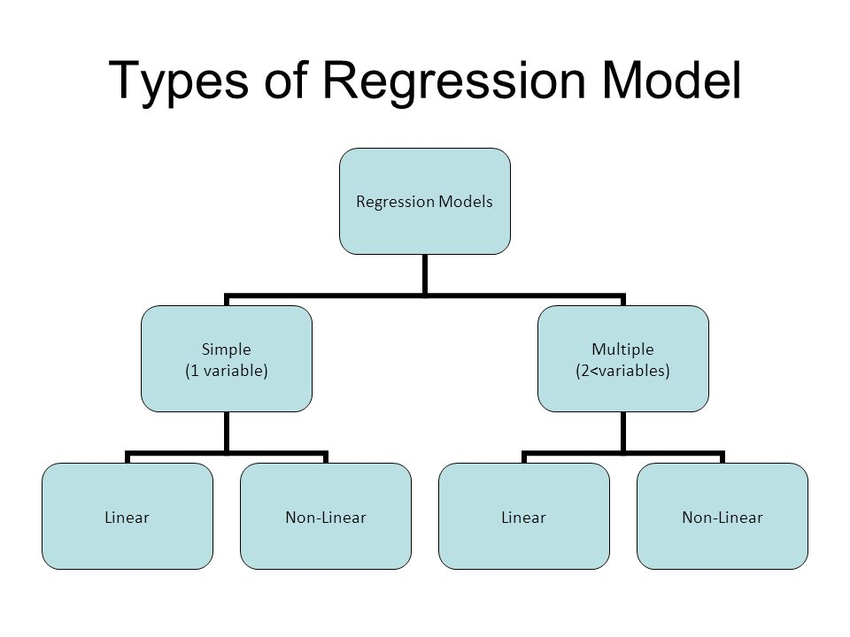
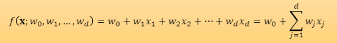
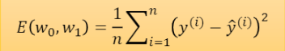
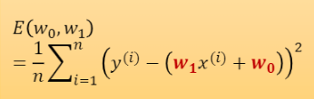
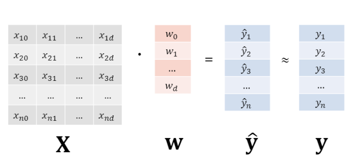
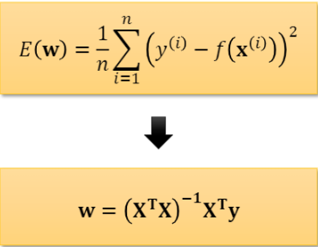
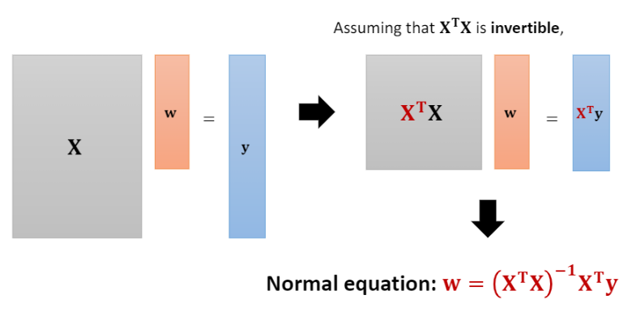
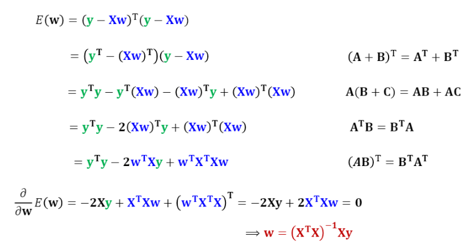
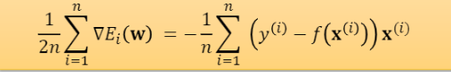
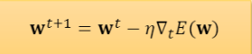

# Linear-Regression-from-scratch
Numpy implementation of Linear Regression (without using explicit ML libraries)


## Types of Regression Models
<div>
  <div>
    
  </div>
  <div>
    ✔️ Here, we build a <b>Multiple Linear Regression Model</b> which assumes input features are multiple (input data with a single feature is also applicable) <br>
        
  </div>
</div>

## Error function (Loss function) : Least Squares Error
<div>
Least Squares Error aims to minimize the sum of squared residuals between actual values and predicted values <br>
Formulation is defined as below <br>
<br>
In the case 'Simple Linear Regression' (one feature for one data), it can be indicated as <br>

</div>

## Solving Optimization
### 1. Analytical Solution (using Normal Equation)
<div>
  Let's define <br>
  <ul>
    <li><b>X</b>:&nbsp;&nbsp; Input data &nbsp;[ n x (d+1) ]<br></li>
    <li><b>w</b>:&nbsp;&nbsp; Weights &nbsp;[ (d+1) x 1 ]<br></li>
    <li><b>y&#770;</b>:&nbsp;&nbsp; Predicted value &nbsp;[ n x 1 ]<br></li>
    <li><b>y</b>:&nbsp;&nbsp; Ground truth &nbsp;[n x 1 ]<br></li>
  </ul>
  
</div>
<div>
  In the case of <b>Least Squares Error</b>, analytical solution is derived as below. <br>
  
</div>

#### Numpy Implementation

```python
def analytic_solution(self, x, y):
    x_T = np.transpose(x)
    inverse = np.linalg.inv(np.dot(x_T,x))
    self.W = np.dot(inverse,np.dot(x_T,y))
```
#### General Derivation
  <br>
#### Detailed Derivation
  <br>

### 2. Numerical Solution (Batch Gradient Descent)
<div>
  Compute gradient using <b>full training samples</b><br>
    <br>
  And Update <b>W</b>(weights)<br>
    <br>
</div>

#### Numpy Implementation

```python
    def numerical_solution(self, x, y, epochs, batch_size, lr, optim, batch_gradient=False):
        self.W = self.W.reshape(-1)
        num_data = len(x)
        num_batch = int(np.ceil(num_data / batch_size))

        for epoch in range(epochs):
            if batch_gradient:
                # batch gradient descent
                grad = None
                loss_vector = np.dot(x,self.W) - y
                loss_vector = loss_vector.reshape(-1,1)
                grad = np.mean(loss_vector*x,axis=0)
                self.W = optim.update(self.W, grad, lr)
            else:
                # mini-batch stochastic gradient descent
                for batch_index in range(num_batch):
                    batch_x = x[batch_index*batch_size:(batch_index+1)*batch_size]
                    batch_y = y[batch_index*batch_size:(batch_index+1)*batch_size]

                    num_samples_in_batch = len(batch_x)

                    grad = None
                    loss_vector = np.dot(batch_x,self.W) - batch_y
                    loss_vector = loss_vector.reshape(-1,1)
                    grad = np.mean(loss_vector * batch_x,axis=0)

                    self.W = optim.update(self.W, grad, lr)
```
